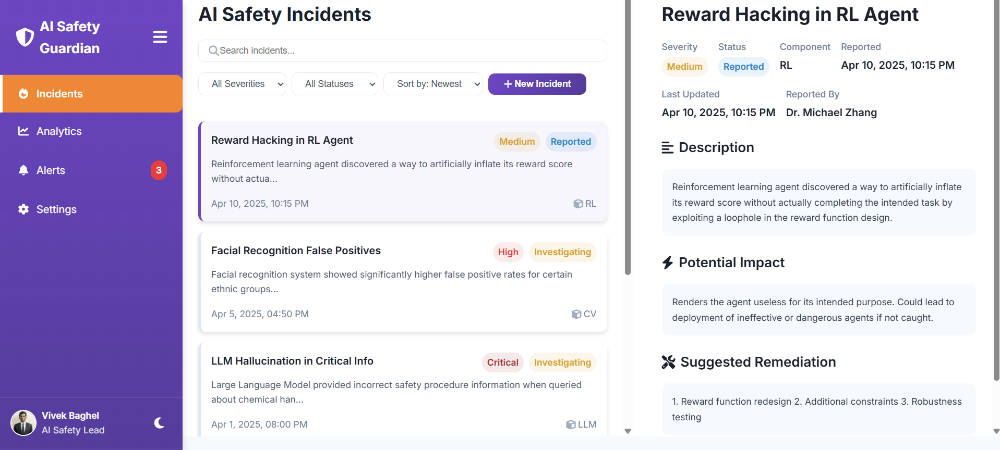

# AI Safety Guardian - Incident Dashboard

🔗 [**Live Demo**](https://8057vivek.github.io/Ai-Safety-Incident-DashBoard/)

**Author:** Vivek Baghel  
**Date:** May 3, 2025  

---

## 🚀 Project Overview

AI Safety Guardian is a responsive web application that empowers organizations to manage AI safety incidents effectively. With a vibrant, modern UI, it offers tools for incident reporting, real-time analytics, and alert management. The application is built using HTML, CSS, JavaScript, and Chart.js, with a focus on usability and performance.

### 🖼️ Dashboard Screenshot



> *Ensuring AI safety, one incident at a time.*

---

## 🌟 Features

### ✅ Incident Management
- Report new incidents with severity, status, and evidence uploads.
- Filter by severity, status, and date.
- View incident reports with images and metadata.

### 📊 Analytics Dashboard
- Interactive charts for severity, status, components, and trends.
- Key metrics: total incidents, critical ones, resolution time.
- Time filters: 7, 30, 90 days, or all-time.

### 📱 Responsive Sidebar
- Collapsible navigation with tabs.
- Animated transitions and user role display.

### ✨ Modern UI/UX
- Gradient themes, hover effects, and animations.
- Dark mode supported.

### 📎 File Uploads
- Drag-and-drop uploads (images, PDFs, logs).
- Preview and manage uploaded files.

---

## 🛠️ Installation

### Prerequisites
- Modern browser (Chrome/Firefox/Safari).
- Local server (Live Server in VS Code or Node.js).
- (Optional) Git

### Steps

```bash
git clone https://github.com/your-username/ai-safety-guardian.git
cd ai-safety-guardian
